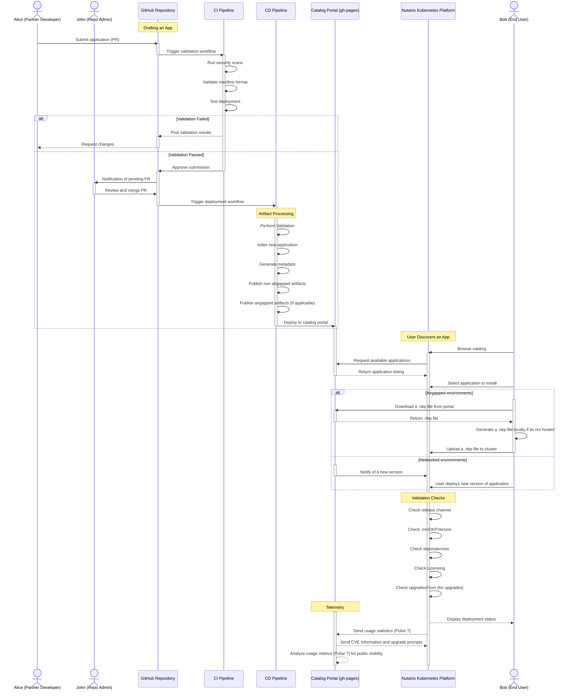

# End-to-end user workflow

:::info Internal page
This page is only visible when `?internal=true` is appended to the URL.
:::

This diagram shows the user-facing journey from discovery to deployment.

