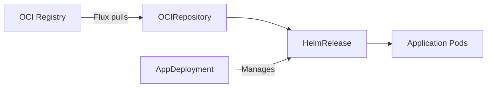

# From OCI artifact to AppDeployment

## Overview

Once a catalog collection is available on an NKP cluster, applications are deployed by creating an AppDeployment resource in a workspace or project. Kommander reconciles the AppDeployment and deploys the application (via Flux HelmRelease) to the selected clusters.

## How it works



1. **Catalog collection** is registered on the management cluster via `nkp create catalog-collection`.
2. Flux's `OCIRepository` controller pulls manifests from the OCI registry at the configured interval.
3. The **AppDeployment** resource (created via UI or CLI) triggers Kommander to deploy the application's `HelmRelease` to target clusters.
4. Flux reconciles the `HelmRelease`, installing or upgrading the Helm chart in the application's dedicated namespace.

## Deploying an application

### Using the NKP UI

1. Navigate to your workspace or project → **Applications**.
2. Find the application in the catalog listing.
3. Click **Enable** (or **Deploy**).
4. Optionally configure values overrides.

### Using the NKP CLI

```bash
nkp create appdeployment <app-name> \
  --workspace <workspace-name> \
  --config-overrides <configmap-name>
```

## Configuration overrides

Override default Helm values by providing a ConfigMap:

```bash
kubectl create configmap my-app-overrides \
  --from-file=values.yaml=./my-values.yaml \
  -n <workspace-namespace>
```

Then reference it when creating the AppDeployment. Kommander waits for the ConfigMap to exist before deploying.

## Upgrading applications

Catalog applications can be upgraded individually (unlike platform applications which are upgraded as a set per workspace). When a new version is available in the catalog collection, use the UI or CLI to trigger the upgrade.
